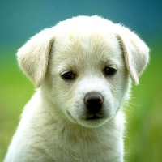

# Image Processing
An application that places different filters and functions on any image. There are 2 functions(copy, scale) and 3 filters(greyscale, edge detection, gaussian blur). The sample image, dog.bmp, is what we will use to apply the filters and functions, and the new transformed image will be created in the images folder.

## Features
 * Copy: Creates an exact copy of the sample image.
 * Scale: Scales the image dimensions by a specified scale factor.

## Filters
 * greyscale: Creates a black and white image.
 * edge detection: Finds the boundaries of objects within the image.
 * gaussian blur: Blurs the image by a Gaussian function. 

> 
